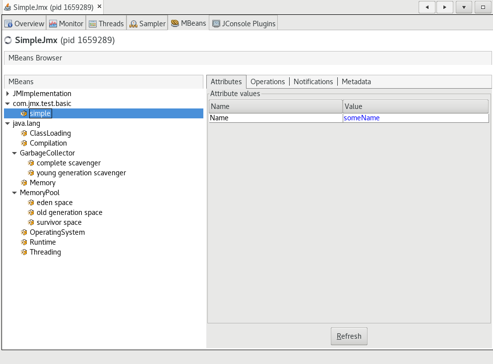

# Build and Run Native Executables with Remote JMX

Remote management using [Java Management Extensions (JMX)](https://www.oracle.com/java/technologies/javase/javamanagement.html) is possible in executables built with GraalVM Native Image.

> Note: The feature is experimental.

This guide covers the steps required to build, run, and interact with such a native executable using JMX.
It also shows you how to register a custom managed bean (MBean), with the JMX server and the additional steps required for it to work with Native Image.

## Step 1: Create a Demo Application

Create a demo application in a directory named `demo`. Place all the files there and run the commands from this directory.

Save the following code to a file named `SimpleJmx.java`. This is the JMX server. Its job is to register a custom MBean, then loop endlessly, so you have time to inspect it using VisualVM.

```java
import javax.management.MBeanServer;
import javax.management.ObjectName;
import java.lang.management.ManagementFactory;

public class SimpleJmx {
    public static void main(String args[]) throws Exception {
        ObjectName objectName = new ObjectName("com.jmx.test.basic:name=simple");
        Simple simple = new Simple();
        simple.setName("someName");
        MBeanServer server = ManagementFactory.getPlatformMBeanServer();
        server.registerMBean(simple, objectName);
        while(true){
            Thread.sleep(1000);
            System.out.println("JMX server running...");
        }
    }
}
```

Next, save the following MBean implementation to a file named `Simple.java`:

```java
public class Simple implements SimpleMBean {
    private String name;
    @Override
    public String getName() {
        return name;
    }
    @Override
    public void setName(String name) {
        this.name = name;
    }
    @Override
    public String print(){
        return "Print output " + name;
    }
}
```

Lastly, save the following MBean interface to a file named `SimpleMBean.java`:

```java
public interface SimpleMBean {
    String getName();
    void setName(String name);

    String print();
}
```

## Step 2: Compile to Java Bytecode

Compile these Java files using the GraalVM JDK:

```shell 
$JAVA_HOME/bin/javac SimpleMBean.java Simple.java SimpleJmx.java
```
It creates `SimpleJmx.class`, `Simple.class`, and `SimpleMBean.class` files.

## Step 3: Make a Dynamic Proxy Configuration

Remote management of MBeans can use dynamic proxies to simplify the client's interaction with MBeans on the server (in a different application). 
Using proxies makes the sending and receiving of data transparent. 
Specifically, the connection, request, and return type conversion are all taken care of in the process of forwarding to the MBean server and back.

To register a custom MBean `SimpleMBean` and be able to interact with it, provide the dynamic proxy configuration for the MBean interface in a JSON file.
Later you will pass this JSON file to the `native-image` builder.

```json
[
  { "interfaces": [ "SimpleMBean"] }
]
```

## Step 4: Build a Native Executable with JMX Support

Build a native executable with the VM monitoring enabled:

```shell
$JAVA_HOME/bin/native-image --enable-monitoring=jmxserver,jvmstat  -H:DynamicProxyConfigurationFiles=/path/to/proxyconfig.json SimpleJmx

```
The `--enable-monitoring=jmxserver` option enables the JMX Server feature which allows accepting incoming connections.
The `--enable-monitoring=jmxclient` option enables the JMX Client feature which allows making outgoing connections.
Both features can be used together, comma-separated, for example, `--enable-monitoring=jmxserver,jmxclient`. 
The `jvmstat` option should also be included if you want to enable discovery by other JVMs: `--enable-monitoring=jmxserver,jmxclient,jvmstat`.

## Step 5: Run the Executable with JMX Properties

Now run your native executable with JMX properties:

```shell
./simplejmx -Dcom.sun.management.jmxremote.authenticate=false -Dcom.sun.management.jmxremote.port=9996 -Dcom.sun.management.jmxremote.ssl=false
```
This starts the application as a simple JMX server, without password authentication or SSL using port `9996`. 
You can configure JMX to apply all the usual properties as shown in [this guide](https://docs.oracle.com/javadb/10.10.1.2/adminguide/radminjmxenabledisable.html), but this example uses a basic configuration for simplicity.

## Step 6: Inspect Using VisualVM

1. Start [VisualVM](https://visualvm.github.io/) to view the managed beans in a user-friendly way. Note that VisualVM is shipped separately and should be first added to GraalVM using `gu`, and then started:

    ```shell
    gu install visualvm
    ```
    ```shell
    $JAVA_HOME/bin/visualvm
    ```

2. Go to the **Applications** tab and select the **SimpleJmx** process. From there you can select the **MBeans** tab.

    

3. In the **MBeans** tab, you can inspect the custom MBean you created earlier and perform operations on it.

    

    

To conclude, Native Image now provides support for remote management using [JMX](https://www.oracle.com/java/technologies/javase/javamanagement.html). Users can enable the JMX agent in a native executable to monitor a client application running on a remote system.

### Related Documentation
- [Enabling and disabling JMX](https://docs.oracle.com/javadb/10.10.1.2/adminguide/radminjmxenabledisable.html)
- [Create Heap Dumps with VisualVM](create-heap-dump-from-native-executable.md)