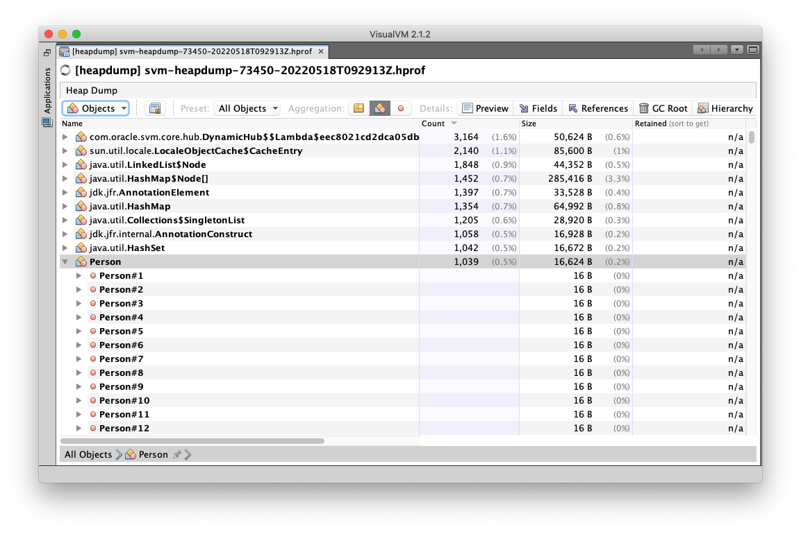
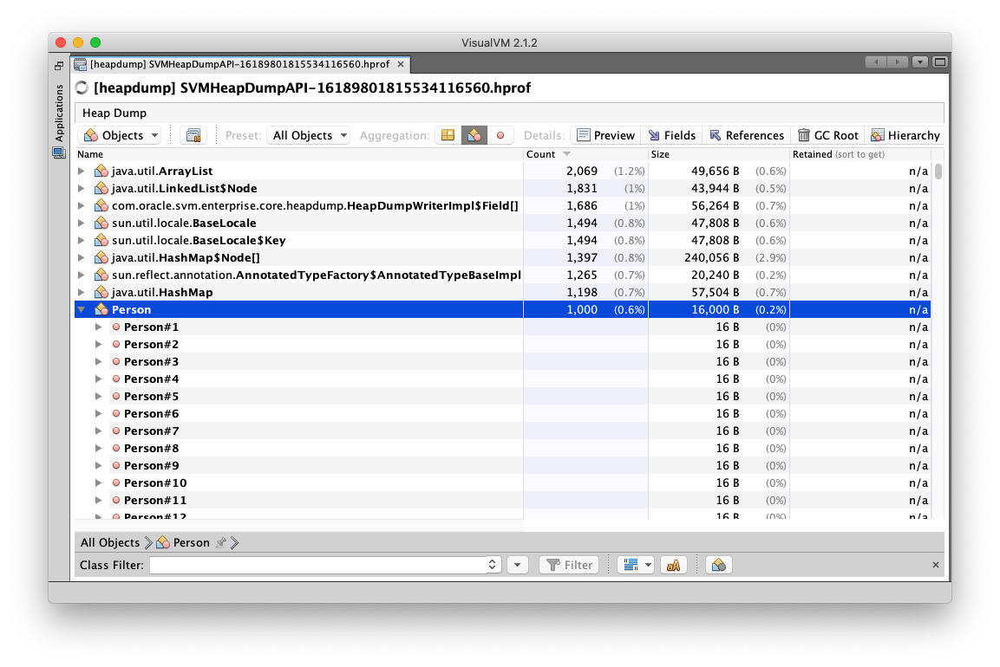

# Create a Heap Dump from a Native Executable

You can create a heap dump of a running executable to monitor its execution. Just like any other Java heap dump, it can be opened with the [VisualVM](../../../tools/visualvm.md) tool.

To enable heap dump support, native executables must be built with the `--enable-monitoring=heapdump` option. Heap dumps can then be created in three different ways:

1. Create heap dumps with VisualVM.
2. Dump the initial heap of a native executable using the `-XX:+DumpHeapAndExit` command-line option.
3. Create heap dumps sending a `SIGUSR1` signal at run time.
4. Create heap dumps programmatically using the [`org.graalvm.nativeimage.VMRuntime#dumpHeap`](https://github.com/oracle/graal/blob/master/substratevm/src/com.oracle.svm.core/src/com/oracle/svm/core/VMInspectionOptions.java) API.

All approaches are described below.

>Note: By default, heap dumps are created in the current working directory. The `-XX:HeapDumpPath` option can be used to specify an alternative filename or directory. For example:  
> `./helloworld -XX:HeapDumpPath=$HOME/helloworld.hprof`

>Also note: Creating heap dumps is not available on the Microsoft Windows platform.

## Create Heap Dumps with VisualVM

A convenient way to create heap dumps is to use [VisualVM](../../../tools/visualvm.md).
For this, you need to add `jvmstat` to the `--enable-monitoring` option (for example, `--enable-monitoring=heapdump,jvmstat`).
This will allow VisualVM to pick up and list running Native Image processes.
You can then request heap dumps in the same way you can request them when your application runs on the JVM (for example, right-click on the process, then select "Heap Dump").

## Dump the Initial Heap of a Native Executable

Use the `-XX:+DumpHeapAndExit` command-line option to dump the initial heap of a native executable.
This can be useful to identify which objects the Native Image build process allocated to the executable's heap. 
For a HelloWorld example, use the option as follows:

```shell
$JAVA_HOME/bin/native-image HelloWorld --enable-monitoring=heapdump
./helloworld -XX:+DumpHeapAndExit
Heap dump created at '/path/to/helloworld.hprof'.
```

## Create Heap Dumps with SIGUSR1 (Linux/macOS only)

>Note: This requires the `Signal` API, which is enabled by default except when building shared libraries.

The following example is a simple multi-threaded Java application that runs for 60 seconds. 
This provides you with enough time to send it a `SIGUSR1` signal. The application will handle the signal and create a heap dump in the application's working directory. The heap dump will contain the `Collection` of `Person`s referenced by the static variable `CROWD`.

Follow these steps to build a native executable that will produce a heap dump when it receives a `SIGUSR1` signal.

1. Make sure you have installed a GraalVM JDK.
The easiest way to get started is with [SDKMAN!](https://sdkman.io/jdks#graal).
For other installation options, visit the [Downloads section](https://www.graalvm.org/downloads/).

2.  Save the following code in a file named _SVMHeapDump.java_:
    ```java
    import java.nio.charset.Charset;
    import java.text.DateFormat;
    import java.util.ArrayList;
    import java.util.Collection;
    import java.util.Date;
    import java.util.Random;
    import org.graalvm.nativeimage.ProcessProperties;

    public class SVMHeapDump extends Thread {
        static Collection<Person> CROWD = new ArrayList<>();
        static DateFormat DATE_FORMATTER = DateFormat.getDateTimeInstance();
        static int i = 0;
        static int runs = 60;
        static int sleepTime = 1000;
        @Override
        public void run() {
            System.out.println(DATE_FORMATTER.format(new Date()) + ": Thread started, it will run for " + runs + " seconds");
            while (i < runs) {
                // Add a new person to the collection
                CROWD.add(new Person());
                System.out.println("Sleeping for " + (runs - i) + " seconds.");
                try {
                    Thread.sleep(sleepTime);
                } catch (InterruptedException ie) {
                    System.out.println("Sleep interrupted.");
                }
                i++;
            }
        }

        /**
        * @param args the command line arguments
        */
        public static void main(String[] args) throws InterruptedException {
            // Add objects to the heap
            for (int i = 0; i < 1000; i++) {
                CROWD.add(new Person());
            }
            long pid = ProcessProperties.getProcessID();
            StringBuffer sb1 = new StringBuffer(100);
            sb1.append(DATE_FORMATTER.format(new Date()));
            sb1.append(": Hello GraalVM native image developer! \n");
            sb1.append("The PID of this process is: " + pid + "\n");
            sb1.append("Send it a signal: ");
            sb1.append("'kill -SIGUSR1 " + pid + "' \n");
            sb1.append("to dump the heap into the working directory.\n");
            sb1.append("Starting thread!");
            System.out.println(sb1);
            SVMHeapDump t = new SVMHeapDump();
            t.start();
            while (t.isAlive()) {
                t.join(0);
            }
            sb1 = new StringBuffer(100);
            sb1.append(DATE_FORMATTER.format(new Date()));
            sb1.append(": Thread finished after: ");
            sb1.append(i);
            sb1.append(" iterations.");
            System.out.println(sb1);
        }
    }

    class Person {
            private static Random R = new Random();
            private String name;
            private int age;
            
            public Person() {
                byte[] array = new byte[7];
                R.nextBytes(array);
                name = new String(array, Charset.forName("UTF-8"));
                age = R.nextInt(100);
            }
        }
    ```

3. Build a native executable:

    Compile SVMHeapDump.java as follows:
    ```shell
    $JAVA_HOME/bin/javac SVMHeapDump.java
    ```
    Build a native executable using the `--enable-monitoring=heapdump` command-line option.
    (This causes the resulting native executable to produce a heap dump when it receives a `SIGUSR1` signal.)

    ```shell
    $JAVA_HOME/bin/native-image SVMHeapDump --enable-monitoring=heapdump
    ```

    (The `native-image` builder creates a native executable from the `SVMHeapDump.class`.
    When the command completes, the native executable `svmheapdump` is created in the current directory.)

3. Run the application, send it a signal, and check the heap dump:

    Run the application:
    ```shell
    ./svmheapdump
    17 May 2022, 16:38:13: Hello GraalVM native image developer! 
    The PID of this process is: 57509
    Send it a signal: 'kill -SIGUSR1 57509' 
    to dump the heap into the working directory.
    Starting thread!
    17 May 2022, 16:38:13: Thread started, it will run for 60 seconds
    ```

    Make a note of the PID and open a second terminal. Use the PID to send a signal to the application. For example, if the PID is `57509`:
    ```shell
    kill -SIGUSR1 57509
    ```

    The heap dump will be created in the working directory while the application continues to run. The heap dump can be opened with the [VisualVM](../../../tools/visualvm.md) tool, as illustrated below.

    

## Create a Heap Dump from within a Native Executable

The following example shows how to create a heap dump from a running native executable using [`VMRuntime.dumpHeap()`](https://www.graalvm.org/sdk/javadoc/org/graalvm/nativeimage/VMRuntime.html#dumpHeap-java.lang.String-boolean-) if some condition is met.
The condition to create a heap dump is provided as an option on the command line.

1. Save the code below in a file named _SVMHeapDumpAPI.java_.

    ```java
    import java.io.File;
    import java.io.FileOutputStream;
    import java.io.IOException;
    import java.nio.charset.Charset;
    import java.text.DateFormat;
    import java.util.ArrayList;
    import java.util.Collection;
    import java.util.Date;
    import java.util.Random;
    import org.graalvm.nativeimage.VMRuntime;

    public class SVMHeapDumpAPI {
        static Collection<Person> CROWD = new ArrayList<>();

        /**
        * @param args the command line arguments
        */
        public static void main(String[] args) {   	
            // Populate the crowd
            for (int i = 0; i < 1000; i++) {
                CROWD.add(new Person());
            }
            StringBuffer sb1 = new StringBuffer(100);
            sb1.append(DateFormat.getDateTimeInstance().format(new Date()));
            sb1.append(": Hello GraalVM native image developer. \nYour command line options are: ");
            if (args.length > 0) {
                sb1.append(args[0]);
                System.out.println(sb1);
                if (args[0].equalsIgnoreCase("--heapdump")) {
                    createHeapDump();
                }
            } else {
                sb1.append("None");
                System.out.println(sb1);
            }
        }

        /**
        * Create a heap dump and save it into temp file
        */
        private static void createHeapDump() {
            try {
                File file = File.createTempFile("SVMHeapDumpAPI-", ".hprof");
                VMRuntime.dumpHeap(file.getAbsolutePath(), false);
                System.out.println("  Heap dump created " + file.getAbsolutePath() + ", size: " + file.length());
            } catch (UnsupportedOperationException unsupported) {
                System.err.println("Heap dump creation failed: " + unsupported.getMessage());
            } catch (IOException ioe) {
                System.err.println("IO went wrong: " + ioe.getMessage());
            }
        }

    }

    class Person {
            private static Random R = new Random();
            private String name;
            private int age;
            
            public Person() {
                byte[] array = new byte[7];
                R.nextBytes(array);
                name = new String(array, Charset.forName("UTF-8"));
                age = R.nextInt(100);
            }
        }
    ```

    As in the earlier example, the application creates a `Collection` of `Person`s referenced by the static variable `CROWD`. It then checks the command line to see if heap dump has to be created, and then in method `createHeapDump()` creates the heap dump.

2. Build a native executable

    Compile _SVMHeapDumpAPI.java_ and build a native executable:
    ```shell
    $JAVA_HOME/bin/javac SVMHeapDumpAPI.java
    ```
    ```shell
    $JAVA_HOME/bin/native-image SVMHeapDumpAPI
    ```
    When the command completes, the `svmheapdumpapi` native executable is created in the current directory.

3. Run the application and check the heap dump

    Now you can run your native executable and create a heap dump from it with output similar to the following:
    ```shell
    ./svmheapdumpapi --heapdump
    ```
    ```
    Sep 15, 2020, 4:06:36 PM: Hello GraalVM native image developer.
    Your command line options are: --heapdump
      Heap dump created /var/folders/hw/s9d78jts67gdc8cfyq5fjcdm0000gp/T/SVMHeapDump-6437252222863577987.hprof, size: 8051959
    ```
    The resulting heap dump can be then opened with the [VisualVM](../../../tools/visualvm.md) tool like any other Java heap dump, as illustrated below.

    

### Related Documentation

* [Debugging and Diagnostics](../DebuggingAndDiagnostics.md)
* [VisualVM](../../../tools/visualvm.md)